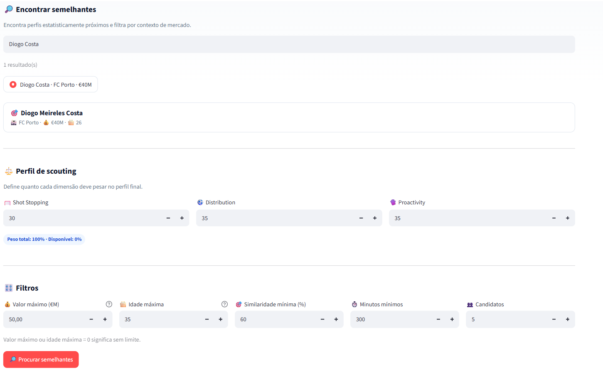
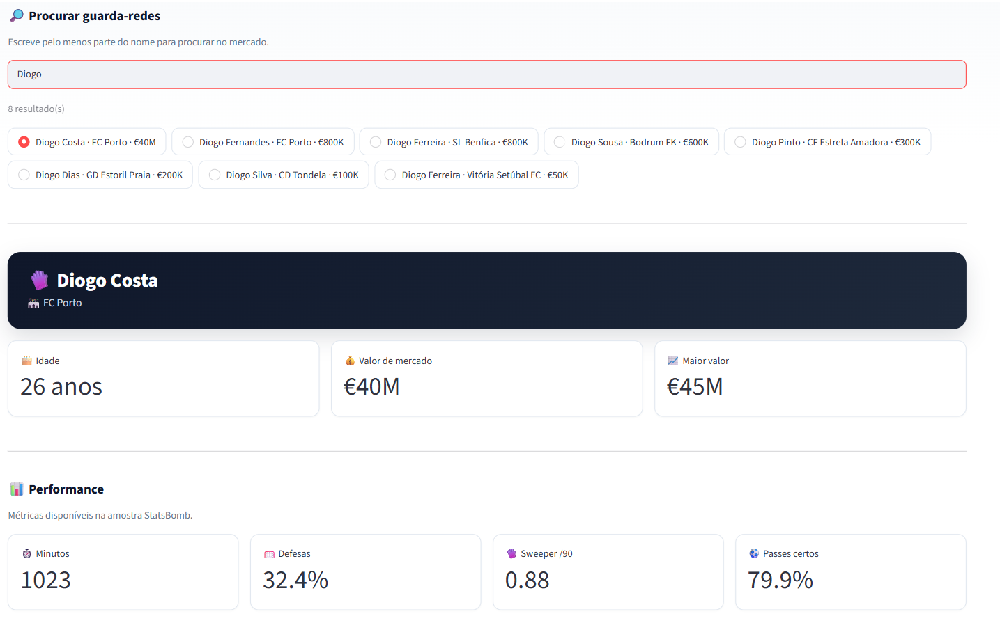
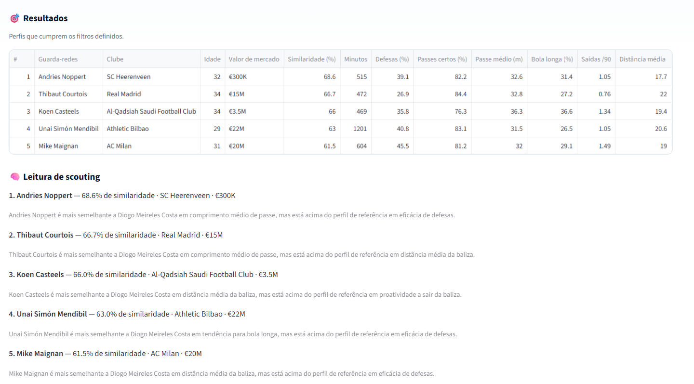
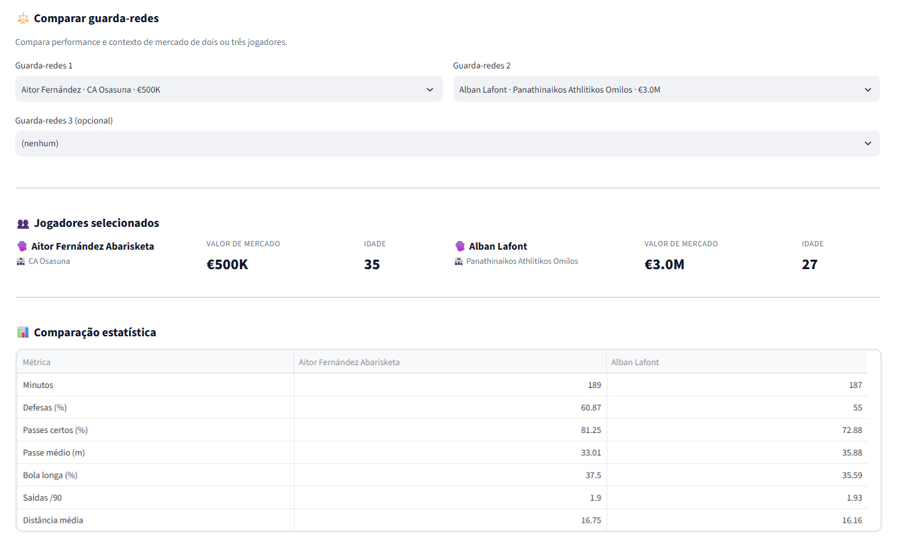
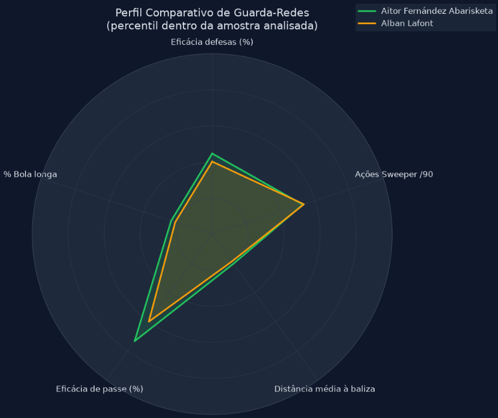

# Goalkeeper Scouting 🧤⚽

> A data-driven football scouting platform focused on goalkeeper analysis, comparison and recruitment.

🚧 **Status: In Development**

---

## 🎯 About the Project

**Goalkeeper Scouting** is a personal data scouting project focused on evaluating and comparing goalkeepers using performance and market data.

The project aims to go beyond traditional statistics such as saves and goals conceded by analysing different aspects of a goalkeeper's profile, including:

- 🧤 **Shot Stopping**
- ⚽ **Distribution**
- 🧠 **Proactivity**

The platform allows users to define a scouting profile, search for similar goalkeepers and compare players according to their statistical profiles and market context.

---

## ✨ Features

### 🔎 Find Similar Goalkeepers

Select a goalkeeper and search for players with statistically similar profiles.

The similarity engine compares multiple performance dimensions and ranks potential candidates according to the selected scouting profile.



---

### ⚖️ Custom Scouting Profile

The scouting profile allows the user to define how important each dimension should be in the final analysis.

- **Shot Stopping**
- **Distribution**
- **Proactivity**

The weights can be adjusted depending on the requirements of a specific scouting context.



---

### 🎯 Similarity Results

After defining the desired profile and filters, the platform returns the goalkeepers that best match the selected criteria.

Users can filter candidates by:

- Maximum market value
- Maximum age
- Minimum similarity
- Minimum minutes played
- Number of candidates

The results also provide additional performance and market information for each goalkeeper.



---

### 📊 Player Comparison

The platform allows users to compare goalkeeper profiles using their performance metrics.



The comparison results are presented visually to make differences between players easier to identify.



---

## 🧤 Performance Model

The project evaluates goalkeeper profiles across three main dimensions.

### Shot Stopping

Measures related to a goalkeeper's effectiveness when dealing with shots and defensive situations.

### Distribution

Measures related to a goalkeeper's ability to contribute to build-up play and progress the ball.

### Proactivity

Measures related to actions outside the goal line and the goalkeeper's involvement in defensive space.

The importance of each dimension can be adjusted through the scouting profile.

---

## 🧠 Similarity Engine

The similarity engine is designed to identify goalkeepers with statistical profiles close to a selected reference player.

The scouting workflow is:

```text
Select goalkeeper
       ↓
Define scouting profile
       ↓
Apply market & performance filters
       ↓
Analyse candidate profiles
       ↓
Calculate similarity
       ↓
Rank candidates
       ↓
Compare players
```

This approach allows the project to move beyond simple player statistics and towards a more practical recruitment workflow.

---

## 📊 Performance Metrics

The platform uses multiple goalkeeper performance indicators covering different aspects of the game.

Examples include:

- Save and defensive effectiveness
- Pass completion
- Average pass length
- Long-ball percentage
- Actions per 90 minutes
- Distance from goal
- Other event-based goalkeeper metrics

The exact set of metrics and methodology is still being refined as the project develops.

---

## 💰 Market Context

Performance analysis is combined with market information to provide a more complete scouting context.

This allows candidates to be evaluated according to factors such as:

- Market value
- Age
- Playing time
- Performance
- Statistical similarity

This is particularly useful when searching for players who fit both a sporting profile and a potential recruitment strategy.

---

## 📚 Data Sources

### StatsBomb Open Data

Football event data is used to calculate and analyse goalkeeper performance metrics.

### Transfermarkt

Market information is used to provide additional recruitment context, including player market values.

> Data availability and coverage may vary between players and competitions.

---

## 🛠️ Tech Stack

### Programming

- Python

### Data Analysis

- Pandas
- NumPy

### Application

- Streamlit

### Data Sources

- StatsBomb Open Data
- Transfermarkt

### Development Tools

- Git
- GitHub

---

## 🗂️ Project Structure

```text
Goalkeeper-Scouting/
│
├── data/
│
├── docs/
│   └── screenshots/
│       ├── compare.png
│       ├── compare_results.png
│       ├── find_similar.png
│       ├── profile.png
│       └── similar_results.png
│
├── tests/
│
├── data_loader.py
├── download_extended_data.py
├── main.py
├── market_data.py
├── metrics.py
├── player_matching.py
├── readable_report.py
├── similarity_engine.py
├── streamlit_app.py
├── visuals.py
│
├── requirements.txt
├── .gitignore
└── README.md
```

The project is still under development, so the structure and implementation may change as new features are introduced.

---

## 🚧 Roadmap

### Data

- [x] Import and process football event data
- [x] Calculate goalkeeper performance metrics
- [x] Integrate market information
- [x] Match performance and market data
- [ ] Expand competition coverage
- [ ] Expand season coverage
- [ ] Improve data validation

### Scouting

- [x] Player search
- [x] Scouting profile
- [x] Custom profile weighting
- [x] Similarity engine
- [x] Market value filters
- [x] Age filters
- [x] Playing-time filters
- [x] Similar-player results
- [x] Player comparison
- [x] Comparison visualisation
- [ ] Refine similarity methodology
- [ ] Expand scouting profiles
- [ ] Add additional recruitment scenarios

### Application

- [x] Streamlit interface
- [x] Player search
- [x] Similar goalkeeper search
- [x] Player comparison
- [x] Comparison visualisation
- [ ] Improve visualisations
- [ ] Improve user experience
- [ ] Expand analysis views
- [ ] Deploy the application

---

## ▶️ Running the Project

Clone the repository:

```bash
git clone https://github.com/azeredo-99/Goalkeeper-Scouting.git
cd Goalkeeper-Scouting
```

Create a virtual environment:

```bash
python -m venv .venv
```

### Windows

```bash
.venv\Scripts\activate
```

### macOS / Linux

```bash
source .venv/bin/activate
```

Install the dependencies:

```bash
pip install -r requirements.txt
```

Run the Streamlit application:

```bash
streamlit run streamlit_app.py
```

---

## 📌 Current Status

The project is currently under active development.

The core scouting workflow is already implemented, including:

- Goalkeeper search
- Performance analysis
- Custom scouting profiles
- Similarity analysis
- Market filters
- Similar-player recommendations
- Player comparison
- Comparison visualisation

The next stages focus on expanding data coverage, refining the scouting methodology and improving the application.

---

## 👤 Author

### Guilherme Azeredo

Computer Systems Engineering graduate interested in software development, data and football analytics.

[GitHub](https://github.com/azeredo-99) · [LinkedIn](https://www.linkedin.com/in/gui-azeredo-a11bb0254/)

---

## 📄 License

This project is intended for educational and portfolio purposes.

Football data is provided by the respective data sources and is subject to their own terms and conditions.
